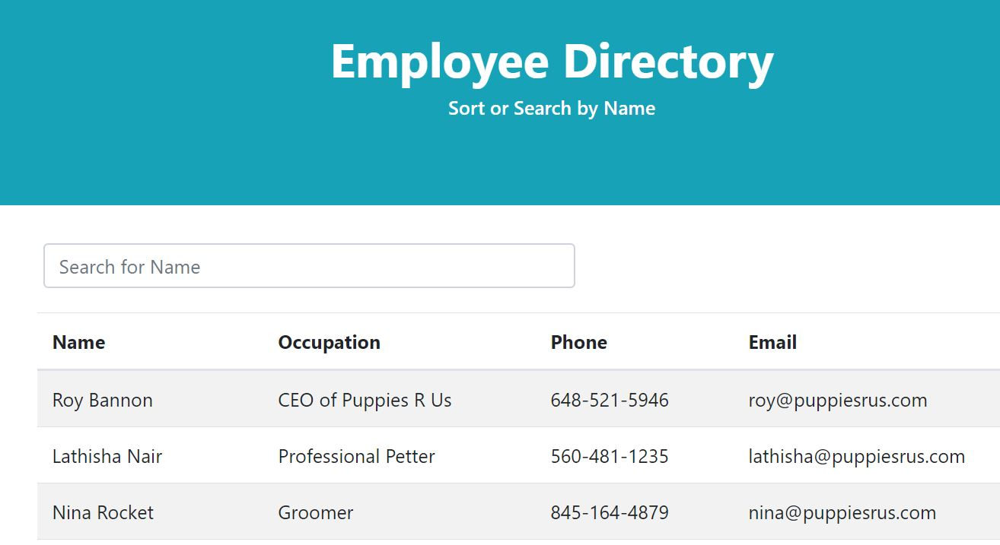

# HW19-React-Employee-Dir


 

 
<center>
<h3>
This is an employee directory using React to break up UI into components of the page. The user is able to sort the names in alphabetical order and search a specific name for quick access to information.
</h3>
</center>

## Business Context

An employee or manager would benefit greatly from being able to view non-sensitive data about other employees. It would be particularly helpful to be able to filter employees by name.
 
## Table of Contents
1. [Technology Used](#technology-used)
2. [Installations](#installations)
3. [Links](#links)
4. [Code Components](#code-components)
5. [Future Development](#future-development)
6. [Contact Info](#contact-info)
 
## Technologies Used:
 
- HTML
- CSS
- Javascript
- JSX
- JSON
- Netlify

## Installations:
```
$ npm react
$ npm react-dom
```
 
## Links:
 
**[Click here to see Project in action!](https://employee-dir-19.netlify.app/)**
 
## Contact Info -
 
Email: <lathisha.n@gmail.com>

LinkedIn: <https://www.linkedin.com/in/lathishanair/>